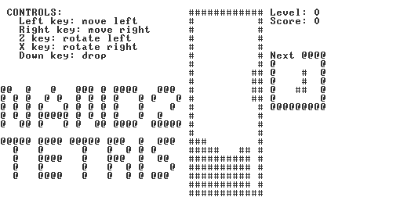

# nand2tetris
  
[Official site](https://www.nand2tetris.org/)

## Requirements
- cmake v3.16

## Build cpp modules
`./create-build.sh`

It'll create `JackCompiler`, `VMtranslator-all`, `Assembler`, and `tests`.

## Compile Jack codes and play Tetris
`./build/bin/JackCompiler source/project/12/Tetris`  
`./external/tools/VMEmulator.sh`

## Translate vm codes into hack assembly languages
`./build/bin/VMtranslator-all *.vm`

## Translate hack assembly languages into machine instructions
`./build/bin/Assembler *.asm`

## Run test
`./run-tests.sh`
